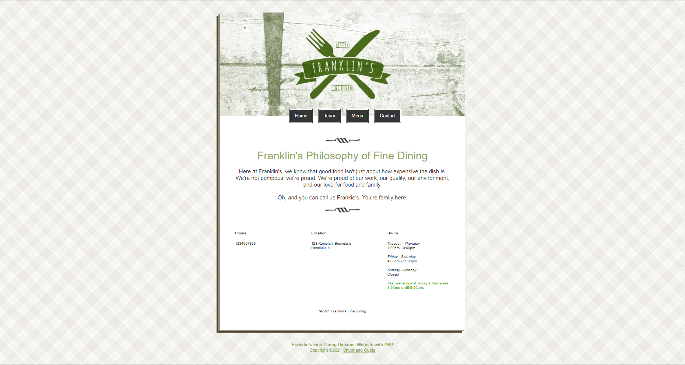

# Franklings-Restaurant

The website is built for a (fictional) retaurant "Franklin's Fine Dining".

This is a small dynamic website.

## Technologies

### Backend

* [PHP (version 8.0.x)](https://www.php.net/)

### Frontend

* [HTML](https://html.spec.whatwg.org/)
* [CSS](https://www.w3.org/TR/CSS/#css)

### Deployement

* [Heroku](https://www.heroku.com)

    Find the hosted website here: [Franklin's Dining](https://franklins-fine-dining.herokuapp.com/)

## License

The MIT Open-Source License

## Screenshot

## Author

[Shubhang Gupta](https://jarvis-1805.github.io/)
